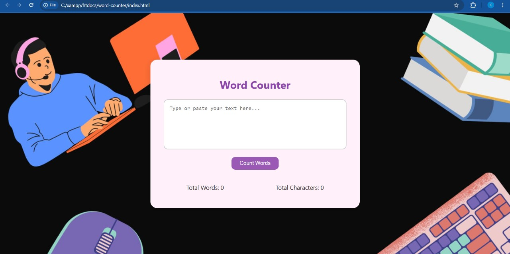

# 📝 Word Counter Web App

A simple, elegant, and responsive web application that lets you **count words and characters** in real-time. Built using vanilla **HTML**, **CSS**, and **JavaScript**, this project reflects both my **design sensibilities** and **developer mindset**.

---

## 🚀 Live Preview

🌐 [View the Live App](https://khushi494.github.io/word-counter/)  
_(Hosted using GitHub Pages)_

---

## 🔍 Features

- ✅ Real-time word and character counter
- ✅ Responsive, mobile-friendly layout
- ✅ Clean UI with subtle interactions
- ✅ Handles edge cases (extra spaces, empty input, etc.)
- 🎨 **Custom background image** personally chosen and styled for a calming writing experience

---

## 📁 Project Structure

word-counter/
├── index.html # HTML layout
├── style.css # Visual styles, including custom background
├── script.js # JavaScript for live word/character count
├── wordcounterimg1.jpg # Screenshot 1
├── wordcounterimg2.jpg # Screenshot 2
└── README.md # This file

---

## 🛠️ Tech Stack

- **HTML5** – structure & semantics
- **CSS3** – styling, responsive layout
- **JavaScript (ES6)** – dynamic behavior

---

## 🧠 What I Learned

- DOM manipulation and event-driven programming
- Responsive design using Flexbox
- Creating polished UI experiences with just HTML/CSS/JS
- Version control with Git & pushing live using GitHub Pages
- Importance of combining **design empathy** with development logic

---

## 📸 Screenshots

| Desktop UI | Word Count in Action |
|------------|----------------------|
|  |  |

---

## 📜 License

This project is licensed under the **MIT License** – you’re welcome to use, fork, and build on it!

---

## 🙋‍♀️ About Me

Hi! I'm **Khushi**, a developer, designer, and aspiring **Product Manager**.

I believe products should not only work — they should *feel* intuitive, thoughtful, and human. I enjoy building small tools like this one that solve real problems with simplicity. This project reflects my belief that even the smallest interactions — like counting words — deserve polish, empathy, and user-centered thinking.

My journey into **Product Management** is driven by curiosity:  
- Why do users behave a certain way?
- What makes a tool truly delightful?
- How can we bridge design, tech, and business for impact?

This project — though simple — represents how I approach both code and product: with clarity, care, and purpose.

- 🧑‍💻 GitHub: [@khushi494](https://github.com/khushi494)
- ✉️ Email: *khushisingh8248@gmail.com*

---

If this project resonated with you, feel free to ⭐ star it or leave feedback!
